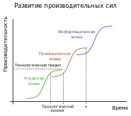

# Социально-экономические эпохи

*Версия 1.0*

## Основание общественного прогресса

Материалистическое понимание истории полагает, что:

1. Основой и движущей силой общественного развития является прогресс производительных сил общества, вызывающий развитие всех остальных сторон общественной жизни. 
2. Прогресс производительных сил означает развитие средств производства, техники и технологий, которое приводит к изменению производственных отношений.
3. Производственные отношения, составляющие базис общества, в конечном счете определяют всю остальную систему общественных отношений.

Таким образом, технический прогресс средств производства является ключом к прогрессивным общественным изменениям вообще.

## Эпохи развития производительных сил

### 1. Присваивающая эпоха

Основана на присваивающем хозяйстве, с преобладающей экономической ролью охоты, собирательства и рыболовства. Для присваивающей эпохи характерны родоплеменные, общинные отношения между людьми. Эта эпоха заканчивается в период неолитической революции, у разных народов проходившей в разное время и протекавшей в общей сложности с 10 тыс. до 1 тыс. лет до нашей эры.

### 2. Аграрная эпоха.

Основана на простом производящем хозяйстве, с преобладающей экономической ролью земледелия, скотоводства и ремесла. Для аграрной эпохи характерен натуральный труд и личная зависимость. Эта эпоха заканчивается в период промышленной революции, происходившей в ведущих государствах мира в XVIII-XIX веках.

### 3. Промышленная эпоха.

Основана на индустриальном хозяйстве, с преобладающей экономической ролью фабричного производства с использованием машин. Для промышленной эпохи характерно повсеместное использование наемного труда и товарного обмена. Эта эпоха заканчивается в период информационной революции, начавшейся в конце XX века.

### 4. Информационная эпоха.

Основана на когнитивном хозяйстве, с преобладающей экономической ролью знания, информационного и автоматизированного производства. Для информационной эпохи характерно производство информационного продукта силами сообществ самих его потребителей.

В Присваивающей и Аграрной эпохе доминирует натуральное производство, в Промышленную эпоху его сменяет всеобщее товарное производство, а в Информационную эпоху наблюдается переход к непосредственно-общественному производству.

## Смена технологических способов производства

Каждую из эпох, кроме первой, можно назвать определенным технологическим способом производства, так как технологическую основу экономического развития в каждую из этих эпох составляют соответственно аграрные, индустриальные и информационные технологии.

Процесс смены эпох происходит с различной продолжительностью. В эти периоды возникает ситуация, когда облик общества определяют сразу два конкурирующих технологических способа производства: старый, доживающий свой век, и новый, активно развивающийся и замещающий собой старый. Эти периоды называются периодами "технологического разрыва".

В приближенном виде динамика смены эпох моделируется цепочкой обобщенных логистических (S-образных) кривых, описывающих жизненный цикл каждого технологического способа производства.

## Наступление информационной эпохи

Сегодня мы живем в период технологического разрыва индустриального и информационного технологического способа производства. Об этом свидетельствует:

1. Углубление проникновения информационных технологий во все сектора экономики в области разработки и управления, ускорение автоматизации операционных областей.
2. Усиление влияния свободного производства внутри сферы информационного производства (прежде всего в его самом передовом секторе - в области разработки программного обеспечения), то есть производства силами широкого сообщества активных потребителей, основанном на общественном владении условиями и результатами их совместного труда.
3. Появление компаний переходного типа, активно использующих производство силами сообществ и выступающих основой его дальнейшего развития.
4. Возрастающее влияние информационных технологий на все сферы жизни общества.

Таким образом, в ближайшем будущем сектор информационного производства станет основным для всей экономики, а свободное производство внутри него - ведущим способом производства, определяющим облик всего общества.

## Общие черты информационного технологического способа производства

Информационный технологический способ производства характеризует:

- Производство силами открытых сообществ.
- Свободная общественная доступность средств информационного производства (исходные коды, знания) и его результатов.
- Слияние производства и потребления: производитель сам же и потребляет произведенное, а потребитель, прямо или косвенно, участвует в производстве.
- Развитие нетоварных форм распределения и обмена (на основе анализа данных о возможностях и потребностях).
- Демократические формы управления большими проектами и сообществами (непосредственное участие производителей в управлении).

## Ссылки

- [Карл Маркс - К критике политической экономии](https://www.esperanto.mv.ru/Marksismo/Krit/index.html)
- [Гринин Л.Е. - Производительные силы и исторический процесс](magnet:?xt=urn:btih:943a5c9f7012a3b905fe0c07e228afe68d43ea25&dn=%d0%9f%d1%80%d0%be%d0%b8%d0%b7%d0%b2%d0%be%d0%b4%d0%b8%d1%82%d0%b5%d0%bb%d1%8c%d0%bd%d1%8b%d0%b5%20%d1%81%d0%b8%d0%bb%d1%8b%20%d0%b8%20%d0%b8%d1%81%d1%82%d0%be%d1%80%d0%b8%d1%87%d0%b5%d1%81%d0%ba%d0%b8%d0%b9%20%d0%bf%d1%80%d0%be%d1%86%d0%b5%d1%81%d1%81&tr=http%3a%2f%2fbt3.t-ru.org%2fann%3fmagnet)
- [Нижегородцев Р.М. - Информационная экономика, кн. 1](http://www.vixri.com/d/Nizhegorodcev%20R.M.%20%20_kn.1-3_Informacionnaja%20ekonomika%20(v%203-x%20knigax)%202002i.pdf)
- [Нижегородцев Р.М. - Логистическое моделирование экономической динамики, ч. 1](https://cyberleninka.ru/article/n/logisticheskoe-modelirovanie-ekonomicheskoy-dinamiki-ch-i/viewer)
- [Старцев Ю.Н. - S-образные модели развития и технологические разрывы](https://cyberleninka.ru/article/n/s-obraznye-modeli-razvitiya-i-tehnologicheskie-razryvy/viewer)
- [Александ Мещеряков - Ноомарксизм](https://github.com/marxizmo/noomarxizm/blob/master/noomarxizm.md)
